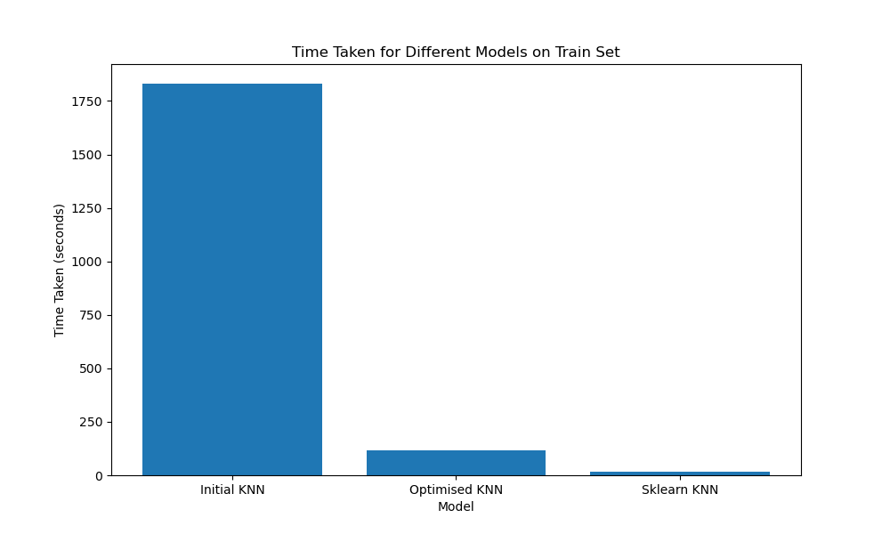
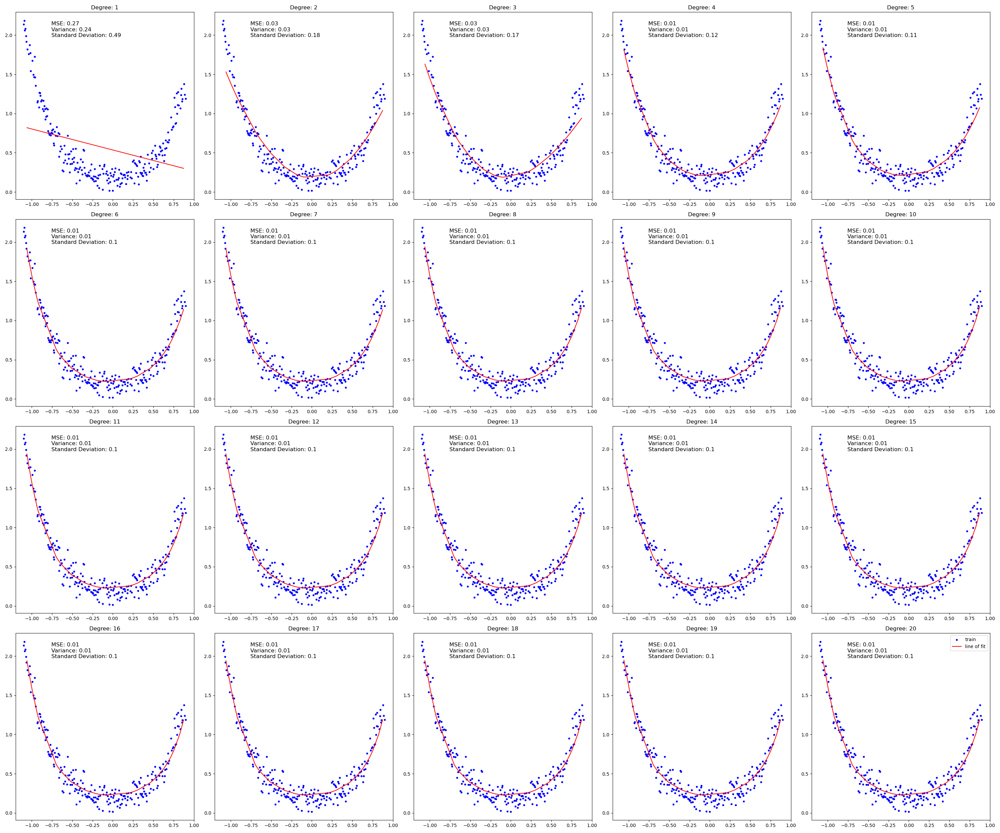

# Assignment 1 Report

# K NEAREST NEIGHBOURS

## Data Analysis and Pre-processing

Some Statistics about the Spotify dataset

- Total number of entries = 1,14,000
- 21 features/columns
    1. unnamed
    2. track_id
    3. artists
    4. album_name
    5. track_name
    6. popularity
    7. duration_ms
    8. explicit
    9. danceability
    10. energy
    11. key
    12. loudness
    13. mode
    14. speechiness
    15. acousticness
    16. instrumentalness
    17. liveness
    18. valence
    19. tempo
    20. time_signature
    21. track_genre

- Null values
    - *artists, album_name, track_name* have null values in one of the row and hence the row is dropped
    - After removing the row with null values, the dataset now contains 113,999 entries.

Individual Feature Analysis and Data Normalisation

1. Genre (track_genre)
    
    data type - string
    
    114 genres
    
    The data is equally distributed across genres - 1000 entries in each genre
    
    
    
    
    
    Note - only 40 genres have been plotted to show distribution in a readable manner
    
2. Non Numeric features
    
    *Unnamed, track_id, artists, album_name, track_name -* these columns have been dropped and the data has been reduced only to the numeric values.
    
    Note - the *explicit* feature has been label encoded to 0 and 1 for False and True respectively.
    
3. Numeric Features Normalisation
    
    All the features have been normalised by using the Gaussian method of normalisation 
    
    $$
    x = \frac {x - \mu}{\sigma}
    $$
    
    where $x$ is a feature point, $\mu$ is the mean of the feature and $\sigma$ is the standard deviation of the feature.
    
    After the pre processing has been done using `data/data_setup/spotify_pre_processing.py` the data was stored to the 
    interim folder - `data/interim/spotify_v1/spotify_v1.csv` 
    
    Using the `data/data_setup/spotify_split.py` function, the data was split into train test and val files and these were used for doing further tasks.
    

Feature Visualisation

1. Histograms 
    
    
    

1. Violin Plots
    
    
    

From the above 2 plots (histogram and violin plots), it is observed that:

1. duration in ms is mostly concentrated in the lower region, with few outliers which have a very high value
2. explicit is mostly below zero(after normalisation)
3. mode, speechiness, instrumentalness and loudness have similar distributions with data mostly saturated in 2 parts.
4. time signature is also present only in a very specific area.
5. Rest of the features like popularity, danaceability, energy, key, acousticness, liveness, valence and tempo are well distributed

1. Correlation Matrix
    
    
    
    This tells us about how closely the features are related. Yellow means most similarity and blue means least.
    

The hierarchy of which columns are more necessary than others for the classification task can be given with the help of the correlation each feature has with the genre. 

```python
acousticness      0.076872
valence           0.053142
liveness          0.033440
popularity        0.032351
mode              0.005166
danceability      0.003573
```

We can remove mode because of the way its distributed and call the others as the final most important features.

*acousticness, valence, liveness, popularity, danceability*

---

### KNN Implementation

1. The genres are label encoded as numbers from 1 to 114. 
2. The fit function basically just stores the X and Y values from the train set.
3. The predict function, iterates over all test points and computes distance between test point and all train points, finds the minimum k distances and reports the genre with maximum frequency in these k classes.
4. Optimisation 
    
    Instead of processing 1 test point at a time, the test set has been divided into batches (each batch of 500 points) and the distance of all these points with all the points in the dataset is calculated at once (in the form of a 2 D matrix of distance values)
    
    This speeds up the process of prediction from roughly 40 mins to 1.5 minutes on the test set containing roughly 10000 data points.
    
    For every batch the time complexity is O(n) where n is the number of train points.
    Since the number of batches is a constant (10000/500 = 20), the time complexity is of O(n). 
    

---

### Code snippets from Initial KNN

```python
# predict
for i, x in enumerate(X):
            y_pred_int[i] = self._predict_individual(x)
            
# predict individual
distances = [self._calculate_distance(x, x_train) for x_train in self.X_train]
k_indices = np.argsort(distances)[:self.k]
k_nearest_labels = [self.y_train[i] for i in k_indices]
most_common = np.bincount(k_nearest_labels).argmax()

# distance metrics
if self.distance_metric == 'euclidean':
	return np.sqrt(np.sum((x1 - x2)**2))
elif self.distance_metric == 'manhattan':
  return np.sum(np.abs(x1 - x2))
elif self.distance_metric == 'cosine':
  cosine_similarity = np.dot(x1, x2) / (np.linalg.norm(x1) * np.linalg.norm(x2))
	return 1 - cosine_similarity
else:
	raise ValueError(f"Unknown distance metric: {self.distance_metric}")
```

---

## Hyperparameter Tuning and Optimisation

Finding best k and distance metric pair (on the basis of best validation accuracy)

Iterating over all k values from 1 to 35 and the 3 distance metrics, with the Optimised KNN model and saving the results to a text file named `knn_results.txt.` This contains k, distance metric, all the performance measures on val set and the time taken to run in the following format.

```python
K: 20, Distance Metric: manhattan
Accuracy: 0.24791648390209667
Precision: 0.23988512314791263
Recall: 0.24962659728560394
F1 Score: 0.24465893064958527
Time taken: 113.40663504600525
```

Running a script, to read this text file and compute the best k, distance metric pair gives the following results.

```python
Best Accuracy:  0.24791648390209667
Best K:  20
Best Metric:  manhattan
```


Inference time vs Train dataset size - Initial KNN vs Best KNN vs Optimised KNN vs Sklearn KNN

Similar to the above task, a file named `knn_results_time.txt` was used to store all the values of the time taken to run the different models on different Train set sizes.

The format in which its saved is:

```python
Optimised KNN
Train size: 50000
Accuracy: 0.22949381524695148
Precision: 0.2239749173703114
Recall: 0.23032917819943946
F1 Score: 0.22710760989505815
Time taken: 65.08797025680542
```

The k used was 20 and distance metric used was manhattan (best k, distance metric from above analysis).

The dataset sizes used were - *1000, 2000, 5000, 10000, 20000, 50000, 90000*

Since the best KNN is determined by performance on the basis of hyper-parameters, the it does not play a role in analysing time taken. Hence 3 models - Initial, Optimised and Sklearn have been compared.

The results are obtained in the following graphs by reading the text file and plotting the results




Observations: All the 3 graphs increase linearly with increase in Train dataset size. This helps us conclude that the time complexity is indeed O(n). The Initial KNN takes a large amount of time with a lot of improvement in Optimised KNN (improvements like threading can lead to obtaining time as close to as Sklearn)

Dropping Random Columns

For number of columns varying from 5 to 15, random columns were selected and the performance was measured in terms of accuracy on the test set. Results were stored to a text file and the following are the plots for the same. 2 plots were obtained one for the accuracy vs num of columns and the other to show the mapping between the colour and the columns.


Yes, it is true that more data need not necessarily mean best results. With number of columns greater than 10, the performance almost becomes the same as that with the initial amount of data that we had.

Evaluating all possible combinations is impractical due to the extensive time required to run these permutations with various data normalisation techniques.

Checking the performance with the best 5 columns based on data analysis on spotify_2 test set:

```python
Accuracy:  0.18017543859649124
Precision:  0.1737253649807471
Recall:  0.1812465624661911
F1 Score:  0.17740628360337884
```

The performance is not just depended on the most important columns decided by the correlation matrix. There might be better ways of determining the hierarchy of columns.

---

## A second dataset

The second dataset is already split into train test and val. With the same pre processing, the processed data is stored in the interim folder and used from there to run the KNN model. Using the best k and distance metric and running the code on Optimised KNN, we get the following results.

- k = 20
- distance metric = manhattan

```python
Accuracy:  0.24754385964912282
Precision:  0.2369876386644725
Recall:  0.24887049909993336
F1 Score:  0.24278375653570425
```

The performance is similar on the spotify_2 dataset also. Hence the model can be considered as good.

---

SOME IMPROVEMENTS IN PERFORMANCE

1. Columns with strings were dropped. They can be converted to a number, by some sort of hashing and this data can be incorporated while finding distance.
2. Weights could be given to the features. More relevant features with higher weights can help in determining the neighbours better.
3. Speed can be improved by threading while computing the distances with all training points.

---

# LINEAR REGRESSION AND REGULARISATION

## Mathematics

Linear Regression is an ML algorithm which requires labelled data and it fits a linear equation to the observed data.

$$
Y = β_0 + β_1X_1 + β_2X_2 +...+ β_pX_p +ε
$$

Y is the dependent variable, X is the independent variable, β are the weights which we need to predict, ε is the error.

Regularisation is done to prevent overfitting by penalising large coefficients in the model.

So, there are 2 approaches to solve the problem. One using the closed form (that is deriving the matrix equation by differentiation w.r.t. β and equating it to 0) and the other using gradient descent. I have implemented both.

Note - The Linear Regression model is only able to handle with dimension of X being one (tested for only 1 dimensional X)

The loss function is given by:

$$
J(\beta)=\frac{1}{2m} \sum_{i=1}^{m}(X\beta−y)^2
$$


With Regularisation:

1. Using L1 Regularisation (Lasso):

$$
J(\beta)=\frac{1}{2m} \sum_{i=1}^{m}(X\beta−y)^2 + \lambda \sum_{j=1}^{n} |\beta_j|
$$

1. Using L2 Regularisation (Ridge):

$$
J(\beta)=\frac{1}{2m} \sum_{i=1}^{m}(X\beta−y)^2 + \frac{\lambda}{2} \sum_{j=1}^{n} \beta_j^2
$$

Now there are 2 ways to minimise this loss:

1. Using gradient descent
    
    The gradient is given by - 
    
    - For L1 regularisation
        
        $$
        \nabla_\beta J(\beta) = \frac{1}{m} X^{\top} (X\beta - y) + \lambda \cdot sign(\beta) 
        $$
        
    - For L2 regularisation
    
    $$
    \nabla_\beta J(\beta) = \frac{1}{m} X^{\top} (X\beta - y) + \lambda \beta 
    $$
    
    The update at every epoch is done by -
    
    $$
    \beta = \beta − lr \nabla_\beta J(\beta)
    $$
    
2. Using closed form
    
    Note - closed form doesn’t support with L1 regularisation as there is a mathematical constraint on β when doing the differentiation.
    
    $$
    \frac{\partial J(\beta)}{\partial \beta} = \frac{1}{m} X^{\top} (X\beta - y) + \frac{\lambda}{m} \beta = 0
    $$
    

$$
X^\top X \beta + \lambda \beta = X^\top y 
$$

$$
(X^\top X + \lambda I) \beta = X^\top y 
$$

where I is the identity matrix of size n x n.

$$
\beta = (X^\top X + \lambda I)^{-1} X^\top y 
$$

When lambda is 0, there is no regularisation term and only simple linear regression is carried out.

---

## Code

1. Gradient Descent 

```python
# the gradient term from linear regression
gradients = (1 / m) * X.T @ (X @ self.beta - y)

# adding the terms from regularisation
if self.regularization == 'l1' or self.regularization == 'lasso':
	gradients += (self.lambda_ / m) * np.sign(self.beta)
elif self.regularization == 'l2' or self.regularization == 'ridge':
	gradients += (self.lambda_ / m) * self.beta

# update step in gradient descent
self.beta -= self.learning_rate * gradients
```

1. Closed form

```python
if (self.regularization == 'l1' or self.regularization == 'lasso') and self.lambda_ != 0:
	raise ValueError("Regularization not supported in closed form")
else:
	self.beta = np.linalg.inv(X.T @ X + self.lambda_ * np.eye(X.shape[1])) @ X.T @ y
```

---

## Data analysis and splitting

First the data was split into train test val (80:10:10 split)

There is a function in data/data_setup called `lin_reg_split.py` which does a random shuffle and splits the data into the train test val sets and saves them to separate csv files which are then further read to perform the given tasks.

Visualising the data: This is done in a python file in the assignments/1/data_analysis folder called `lin_reg_data_vis.py`


## Performance

Running the simple linear regression model and getting the metrics for the performance (MSE, Std. deviation and Variance) on train, test and val sets.

- learning rate = 0.001
- epochs = 10000
- using gradient descent method

All the runs were made from the `assignments/1/a1_linreg.py` and were saved to a text file called `lin_reg_results.txt` for future analysis. All plots are saved in the `figures/lin_reg folder`

- Results [Performance Metrics for all 3 sets]

```python
Linear Regression results on train_set
Mean Squared Error: 0.3669530202202325
Standard Deviation: 0.6057664733378966
Variance: 0.3669530202202325

Linear Regression results on test_set
Mean Squared Error: 0.3448313636472773
Standard Deviation: 0.5778674690615095
Variance: 0.33393081179955475

Linear Regression results on val_set
Mean Squared Error: 0.22669737674873267
Standard Deviation: 0.47488813079064063
Variance: 0.22551873676582862
```

- Plot of training point with fitted line


- Playing with Learning Rates


using gradient descent


using closed form

Multiple times the above graph was obtained, in most of the cases the MSE is minimum when the learning rate is 0.1 

Note - There is almost no difference between the MSE by changing learning rate between $10^{-1}$ and $10^{-3}$ . 

*For all subsequent runs, a learning rate of 0.1 is used.*

Higher Degree Polynomial

Analysis of MSE on test set vs degree of the polynomial


least MSE at k = 15


least MSE at k = 22

All the logging has been done in a text file called as `lin_reg_higher_degree.txt` 

The log for one of the degrees is shown below

```python
Polynomial Degree: 22
Train 

Mean Squared Error: 0.010021377770080539
Standard Deviation: 0.10010683121183153
Variance: 0.010021377655274128
Test 

Mean Squared Error: 0.01375111865738705
Standard Deviation: 0.11725377540891495
Variance: 0.013748447847644268
Parameters: 
[ 0.46992939  0.84223896  1.19422331  1.14546468 -0.86653749 -0.14431798
  1.31626293  0.03768447  1.82044995  0.34707232  0.36528219  0.66139789
  0.63440856  0.5769372  -0.08250274  1.59760481 -0.32602185  0.73472347
  0.69280843  0.04396416 -0.56074386 -0.31871664  0.60198559]
```

Note - There is a spike in the MSE when doing closed form due to the inability to compute higher dimensional matrix inverses.

---

## Animation

- Train data and the Curve of fit
- MSE
- Standard Deviation
- Variance

The fit function has been modified to plot and save the above subplot after every epoch

The images will stop generating when either the epochs are reached (250 - handling more than 250 images becomes difficult for making gifs) or the difference between consecutive mse or var or std dev is less than some epsilon (0.001)

The figures are saved to a folder and the gif is made from them taking reference from the link provided.

This has been done for different values of k (1, 3, 5, 13, 15) and the gifs are here - 


k = 1


k = 3


k = 5


k = 13


k = 15

These are the gifs for different k values.

MSE, variance and std. deviation are plotted against no. of epochs (max being 250)

Blue dots are training points and red line is best fitting curve at every epoch.

Since the initialisation of weights is random, an initialisation far from the true values takes a long time to converge i.e., more number of epochs.

For example, for k=5, depending on how close were the initial weights, in one instance of the run, within 150 images the difference between the performance measure went below epsilon whereas in another instance the initialisation was completely opposite to what was to be fit and hence it did not converge even after epochs were reached.


bad initialisation k=5


good initialisation k=5


bad initialisation - did not fully converge even after 250 epochs


good initialisation - converged in 150 epochs

Note the MSE starts at a higher value in case of bad initialisation and the rate of decrease is higher in bad initialisation.

---

## Regularisation

First the data was split into 80:10:10 using the split function in the data_setup folder and the split csv files were stored in the processed folder.

The distribution of points in the train set is as shown in the figure below:


Overfitting with higher degree polynomial (k from 1 to 20) and plotting the line of fit along with MSE, variance and std deviation.

- Learning rate = 0.1
- epochs = 10000
- using gradient descent

Before regularisation


Minimum MSE:  0.008687607656104678
Polynomial Degree with min MSE on test set:  13


For Regularisation comparison, $\lambda$ = 5

L1 Regularisation


Minimum MSE:  0.020165187465400594
Polynomial Degree with min MSE on test set:  7


L2 Regularisation



Minimum MSE:  0.009800223365571674
Polynomial Degree with min MSE on test set:  20


Note - Due to the random initialisation of weights the best k for which MSE is less keeps varying on different runs as the difference in MSE is very negligible.

Comparison of MSE in above three cases with learning_rate = 0.01, epochs = 10000, k=5, $\lambda$ = 1 for regularisation:


With regularisation, the MSE, variance and standard deviation decreases in higher k values which means the over fitting is avoided, though the difference is very less.

---
