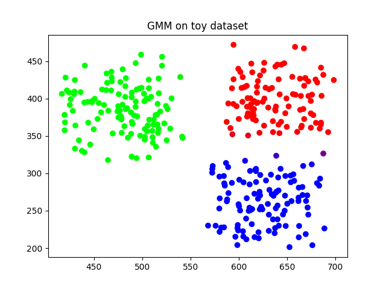
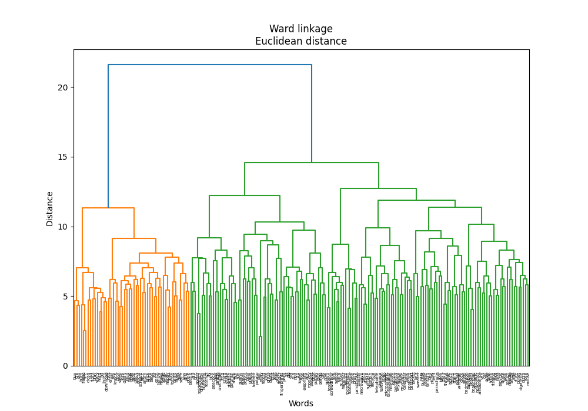
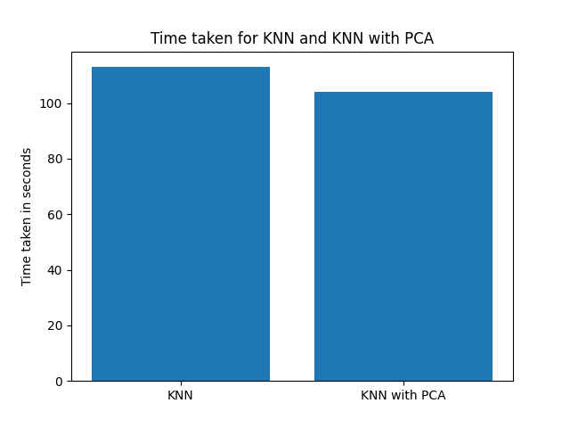

# Report - Assignment 2

---

**Abhinav Raundhal
2022101089**

---

## K-Means Clustering

For performing k means clustering: fit(), predict() and getCost() functions have been implemented.

Algorithm:

1. Randomly initialise k cluster centroids 
2. For each data point calculate the distance to each centroid and assign that cluster to which the distance is minimum
3. Update the cluster centroids until max iterations are reached or clusters don’t change
4. Cost function calculates the Within-Cluster Sum of Squares

Testing the k means clustering on the toy dataset.

The 3 colours represent the 3 clusters and the “X” marks represent the cluster centroids.


The results on the word_embeddings data. 

Data processing: The data was split into 512 columns and was stored in a csv file which was then given as input to the KMeans model.

The elbow point determination using the plot b/w WCSS and k obtained as follows:


To determine the best k with the elbow method, we check where the slope tapers down. From the above graph(and multiple runs to obtain the same graph), the elbow point can be around 5-7. Roughly around these points the slope decreases and the graph tends to become horizontal. So, we can consider k=6 to be the elbow point.

`$k_{means1}$ = 6`

```python
# results for kmeans1
k = 6
WCSS:  3951.728
```

---

## Gaussian Mixture Model

The GMM class contains functions fit(), getParams(), getMembership() and getLikelihood().

The basic idea is to consider each data point to be sampled from some gaussian distribution and instead of a hard clustering we do soft clustering by assigning probabilities with which a point belongs to a cluster instead of directly assigning a cluster to a point.

The initialisation can be done using multiple ways:

1. means 
    1. random points from the data
    2. random numbers generated between min and max of the data
    3. using k means 
2. covariance matrix
    1. Identity matrix
    2. $A^T A$ where A is any randomly generated d dimensional matrix and this ensures the symmetric positive definiteness required for a covariance matrix
3. priors or weights 
    1. just k numbers summing up to 1 telling us the probability of a cluster
    

Means have been initialised randomly from the data points, covariances are identity matrices.

Responsibilities = these tell us for every point whats the probability that it will belong to a cluster

There are 2 steps in the GMM algorithm 

1. E step
    1. The responsibilities are calculated for every data point for being in each of the cluster using the Bayes rule. We multiply the prior with the pdf of the normal distribution and divide the total probability.
        
        ```python
        self.responsibilities = np.zeros((self.n_samples, self.n_clusters))
        for j in range(self.n_clusters):
        	 self.responsibilities[:, j] = self.priors[j]
        	 * scipy.stats.multivariate_normal.pdf(self.X, mean=self.means[j], 
        	 cov=self.covariances[j], allow_singular=True)
                    
        responsibility_sums = np.sum(self.responsibilities, axis=1, keepdims=True)        
        self.responsibilities = self.responsibilities / responsibility_sums
        ```
        
2. M step
    1. Here the means, covariances and priors are updated by the following formulae:
    
    ```python
    for j in range(self.n_clusters):
    	Nk = np.sum(self.responsibilities[:, j])
    	self.means[j] = np.sum(self.responsibilities[:, j].reshape(-1, 1) 
    									* self.X, axis=0) / Nk
    	self.covariances[j] = np.dot((self.responsibilities[:, j].reshape(-1, 1)
    						 * (self.X - self.means[j])).T, (self.X - self.means[j])) / Nk
    	self.priors[j] = Nk / self.n_samples
    ```
    

Convergence condition: when the log likelihood difference is smaller than some epsilon or the log likelihood decreases (this is due to the log likelihood calculation instability) or the max iterations are reached we break out from the loop.

**fit()** function basically calls the initialisation and does these iterations which involves calling the e and m step functions

**getMembership()** function returns the responsibilities, which is basically the soft memberships of the points to the clusters and then we can use these by taking maximum for doing hard clustering.

**getLikelihood()** and **getLogLikelihood()** functions are implemented to return the overall likelihood and the log likelihood respectively.

Soft clustering on toy dataset with 3 gaussians



It is visible in the graph the purple colour dots on the boundary of red and blue which shows the soft clustering of the points.

Handling numerical instabilities:

Since the dataset is 200x512 dimensional, the number of features being larger than the number of sample points, the covariance matrix becomes singular at times giving nan or infinity values while calculating the pdf of the normal distribution. This results in responsibilities, likelihood to be 0. Now because of this there can be division by 0 or log(0) possibilities.

To correct these:

- The covariance matrix has been initialised with identity
- At places where the responsibilities become zero, resulting in the sum of responsibilities also becoming zero, a 0/0 situation arises which has been handled by making this value = 0 when responsibilities are 0 themselves
- To allow singular covariance matrix, argument for allow_singular in the multivariate_normal function from scipy has been set to True.

With these corrections, the GMM class works on the word_embeddings dataset but the log likelihood does not match with sklearn. This is due to the optimisations that sklearn does while initialisation and handling numerical instabilities in calculations of singular matrices, division by 0, log(0) etc.

The comparison of results between GMM class implemented and the sklearn’s GMM class:

```python
k = 3
GMM
Log likelihood:  238.7776240052568

sklearn GMM
Log likelihood:  2613.0367208668595
```

Note: These values for comparison are **average** log likelihood (as given by sklearn)

The difference in values is due to the above mentioned reasons, mainly because of the dimension of the data and its forth comings. 

With the dimension of the data reduced to 50 features, the following are the results:

```python
k = 3
data reduced to 50 dimensions

GMM
Log likelihood:  29.996308353570548

sklearn GMM
Log likelihood:  27.388932574324436
```

The above results are very much same as that of sklearn. This is true as the number of features is 50 which is much less than the number of samples in the dataset.

AIC (Akaike Information Criterion) and BIC (Bayesian Information Criterion) are metrics that measure the relative prediction errors of different models. The lower the value is, the better the model is.

Formulas for AIC, BIC and getting the n-params

```python
def AIC(log_likelihood, n_params):
        return 2 * n_params - 2 * log_likelihood
    
def BIC(log_likelihood, n_params, n_samples):
	return n_params * np.log(n_samples) - 2 * log_likelihood
    
def get_n_params(k, d):
	return k*d + k*(d*(d+1))/2 + k - 1

```

With the implemented GMM


With sklearn GMM


From both the graphs its clear that the AIC and BIC are minimum at k=1.
This may be due to the data considering all 512 features that the most optimum number of clusters is 1.

 `$k_{gmm1} = 1$`

Results of performing GMM with k=1

```python
AIC and BIC using implemented GMM
k:  1 
Log likelihood:  1.7767309311057873
AIC:  263676.4465381378
BIC:  698526.6081438308
# as calculated using formula

AIC and BIC using sklearn
k:  1 
Log likelihood:  1876.2763722088857
AIC: -486830.5488835543
BIC: -51980.38727786124
# as reported by sklearn

```

Note: The calculations for AIC and BIC for the GMM implemented are done by taking the log likelihood whereas to compare with the sklearn the value printed is the average log likelihood

---

## Principal Component Analysis

- This model has been implemented with the help of 3 functions fit(), transform() and checkPCA().
- fit() function is the most important function.
    - First we find the mean of the data and shift everything around the mean by subtracting mean from each data point.
    - Next we find the d x d covariance matrix, its eigen values and eigen vectors.
    - Consider the highest n_components eigen values and their corresponding eigen vectors and compute the projection matrix $P$ .
- transform() function takes this projection matrix and multiplies it with the original data X to give a reduced dimensional data $Xpca$ .
- checkPCA()
    - check whether the dimensions of the $Xpca$  are same as that with which the class was instantiated (n_components).
    - reconstruct the original data from $Xpca$ using inverse transform and compute the reconstruction error in the following way:
        
        ```python
        reconstruction_error = np.mean((X - pca.inverse_transform(X_pca)) ** 2)
        print("Reconstruction error: ", reconstruction_error)
        
        ```
        
    
    $$
    Xpca_{r \times d} = P_{r \times m} X_{m \times d}
    $$
    

where $r$ is n_components, $d$ is the dimensionality of the dataset and  are the number of samples in the dataset. $P$ is the projection matrix, $X$ is the original d dimensional data and $Xpca$ is the transformed data to r dimensions.

PCA on word_embeddings dataset to reduce the dimensions to 2 and 3.


The new axis represent the eigen vectors corresponding to the highest eigen values.

Semantically, the x axis (principal component 1) captures verbs, actions and emotions: positive values represent higher degree of emotion like love cry happy etc.

On the y axis, the extent of livingness is captured. Negative values represent more living nature as words like elephant ant panda bee cow are in the lower half, where as objects like telephone dustbin sword brush are on the positive side in the upper half. 

Another observation is the word length, it increases over the y axis in the positive direction.


From the above scatter graphs it is visible that there are 3 clusters: one in which the clutter of points in maximum and the 2 sparse region of points on the sides of this cluster.

From the above plot containing words, there is a semantic grouping that can be observed.

To the right are action words and emotions like happy, scary, love, listen, download etc.

To the bottom left we have animals, things related to living beings like panda, cat, cow, crocodile, elephant, tomato, potato

The clustered part mostly contains objects like clock, keyboard, basketball, boat, tree etc.

Hence on the basis of these observations we can get the points broadly classified into 3 clusters.

Hence we can say that:

`$k_2 = 3$`

Results and comparison with sk-learn

```python
PCA on word embeddings

PCA to 2 components
Reconstruction error:  0.038359611616054216
PCA check: True
PCA to 3 components
Reconstruction error:  0.036926228885971545
PCA check: True

PCA using sklearn

PCA to 2 components
Reconstruction error:  0.03835961171440547
PCA to 3 components
Reconstruction error:  0.03692623571291911
```

PCA check: True denotes the output from the checkPCA() function which verifies the PCA is done correctly.


Comparing the plots obtained by the PCA implemented from scratch and those from sklearn, we observe that they are not exactly the same. But they are just reflection over both the axes. This is because the eigen vectors that the 2 methods calculate may not be the same but can be perpendicular and hence the reflected plots are obtained. 

---

## PCA + Clustering

1. K-means Clustering Based on 2D Visualization
    
    using $k_2 = 3$
    
    K means clustering is performed to obtain the following results:
    
    ```python
    # results for k2
    k = 3
    WCSS:  4146.197931398514
    ```
    

1. PCA + K Means Clustering
    
    scree plot : take all eigen values sort them in the descending order and plot the top values to check which eigen values mostly contribute.
    
    
    
    
    
    From the above graphs it is clear that the optimal number of dimensions is 6 as components after 6 do not contribute significantly and hence can be dropped and the dataset is now reduced to 6 dimensions.
    
    Elbow method on reduced dataset:
    
    
    
    From the above graph we can say that k can be taken as 6.
    
    `$k_{means3} = 6$`
    
    ```python
    # results for kmeans3
    k = 6
    WCSS:  3958.7762630646566
    ```
    

1. Performing GMM on dataset with k2 = 3
    
    ```python
    k = 3
    GMM
    Log likelihood:  197.2169631974343
    ```
    

1. Optimal number of clusters for the reduced dataset (dimensions = 6) using AIC or BIC
    
    
    
    From the plot for BIC it is clear that:
    
    `$k_{gmm3} = 3$`
    
    GMM on k_gmm3 on reduced dataset:
    
    ```python
    k = 3
    GMM
    Log likelihood:  -4.938690370726346
    ```
    

---

## Cluster Analysis

To have a comparison of cluster visualisation between the k values we need to get the data into the same format, we reduce the data to 2 dimensions to have a good enough visualisation of the data in 2D coordinate plane along with the words and observe the clusters. The cluster labels are obtained from the respective methods 

1. K Means Cluster Analysis 
    
    Clustering results obtained using $k_{means1}$, $k_2$, and $k_{means3}$.
    
    `k_{means1} = 6`  
    kmeans on 512 dimensional data 
    
    
    
    ```python
    # results for kmeans1
    k = 6
    WCSS:  3956.809558019845
    
    Cluster 1:
    deer, panda, helicopter, cat, giraffe, gym, rifle, cow, pencil, bed, starfish, van, sweater, jacket, sun, pear, peacock, saturn, fruit, ant, goldfish, bee, tree, beetle, ambulance, tent, tomato, dragonfly, parachute, butterfly, car, lantern, elephant, windmill, crocodile
    
    Cluster 2:
    spider, lizard, frog, puppet, monkey, spiderman, snake, airplane
    
    Cluster 3:
    needle, eraser, table, carrot, brush, mug, feather, spoon, stairs, 
    microwave, knit, cigarette, microphone, bench, feet, flute, scissor, laptop, calendar, chair, mouse, ladder, finger, candle, oven, calculator, pillow, envelope, toothbrush, screwdriver, teaspoon, length, television, throne, camera, loudspeaker, telephone, stove, knife, toothpaste, toaster, comb, shoe, keyboard, fork, radio, suitcase, paintbrush
    
    Cluster 4:
    listen, flame, knock, download, hard, fight, call, selfie, hit, cry, sleep, clean, sad, slide, draw, pray, arrest, email, buy, burn, fire, close, angry, lazy, scary, hang, book, enter, happy, loud, love, recycle, cut
    
    Cluster 5:
    drive, sing, dive, fishing, smile, bullet, shark, grass, forest, lake, scream, kiss, roof, catch, plant, notebook, baseball, hollow, bucket, puppy, boat, basket, fish, drink, grape, badminton, igloo, bird, clock, skate, tattoo, dustbin, rain, tank, pizza, swim, sword, rainy, basketball, bicycle, arrow, walk, truck
    
    Cluster 6:
    ape, rose, sit, exit, brick, bear, bury, eat, postcard, bend, fly, face, climb, kneel, passport, paint, far, dig, run, clap, pull, empty, door, hammer, earth, fingerprints, key, zip, pant, cook, wheel, potato, sunny
    ```
    
    The clustering here is not stable and changes with different runs based on the initialisations. Also the plot is not a clear representation of how the clusters look. The reason being, we are visualising a 512 dimensional data in 2 dimensions. 
    
    Semantic sense of these clusters:
    
    1. Cluster 1 (Animals, Vehicles, and Objects)
        - Deer, panda, cat, helicopter, rifle, car, sun, Saturn, etc.
        - Analysis: A mixture of animals and inanimate objects, including vehicles and celestial bodies. The cluster groups together natural elements (animals) and man-made objects, showing less semantic coherence.
    2. Cluster 2 (Reptiles and Insects)
        - Spider, lizard, frog, monkey, snake, airplane, etc.
        - Analysis: Focuses on reptiles and insects but includes outliers like airplane. While the animals are coherent, mixing them with technology seems unreasonable.
    3. Cluster 3 (Household Items and Tools)
        - Needle, eraser, mug, laptop, chair, scissor, etc.
        - Analysis: Groups various household items and tools together, showing high semantic cohesion around daily objects and utensils.
    4. Cluster 4 (Actions/Emotions)
        - Listen, knock, fight, sleep, happy, love, angry, etc.
        - Analysis: Focuses entirely on actions and emotions, forming a semantically strong and consistent cluster.
    5. Cluster 5 (Leisure and Outdoor Activities)
        - Drive, sing, fishing, bird, boat, rain, basketball, etc.
        - Analysis: Combines leisure activities and outdoor elements, but also mixing unrelated terms (e.g., fish and pizza).
    6. Cluster 6 (Basic Actions and Tools)
        - Ape, sit, bend, paint, hammer, wheel, etc.
        - Analysis: Primarily actions and tools, with some everyday objects
    
    ---
    
    `k_2 = 3` PCA to 2 dimensions and by observation
    
    ```python
    # results for k2
    k = 3
    WCSS:  4146.197931398514
    ```
    
    
    
    This is my visualisation on the reduced 2 dimensional dataset to get 3 clusters. Explanation is written above: refer to Principal Component Analysis 
    
    ---
    
    `k_{means3} = 6` kmeans on reduced dataset (4 dimesional data)
    
    
    
    ```python
    # results for kmeans3
    k = 6
    WCSS:  271.8040722165602
    
    Cluster 1:
    listen, flame, knock, bury, download, hard, fight, call, hit, far, cry, sleep, clean, draw, pray, arrest, email, buy, burn, fire, close, lazy, scary, hang, book, enter, happy, loud, love, recycle, cut
    
    Cluster 2:
    table, mug, passport, roof, stairs, bed, microwave, sweater, microphone, jacket, bench, bucket, boat, laptop, door, calendar, badminton, chair, ladder, igloo, clock, oven, calculator, pillow, envelope, dustbin, ambulance, television, throne, tent, loudspeaker, lantern, telephone, stove, wheel, toaster, keyboard, radio, suitcase
    
    Cluster 3:
    needle, eraser, carrot, brush, feather, spoon, knit, cigarette, flute, scissor, finger, candle, hammer, toothbrush, screwdriver, fingerprints, teaspoon, length, sword, knife, toothpaste, comb, fork, paintbrush
    
    Cluster 4:
    panda, ape, sit, cat, eat, gym, rifle, cow, pencil, dig, run, van, sun, feet, sad, ant, bee, camera, tomato, car, pant, potato
    
    Cluster 5:
    deer, helicopter, fishing, bear, spider, shark, grass, giraffe, forest, lizard, frog, lake, monkey, starfish, pear, peacock, saturn, fruit, grape, mouse, goldfish, bird, spiderman, tree, beetle, snake, airplane, dragonfly, parachute, butterfly, elephant, rainy, bicycle, windmill, crocodile
    
    Cluster 6:
    drive, sing, rose, dive, exit, brick, smile, bullet, postcard, bend, puppet, fly, face, climb, kneel, scream, kiss, selfie, catch, paint, plant, notebook, clap, pull, baseball, hollow, puppy, basket, empty, fish, slide, drink, angry, skate, tattoo, earth, rain, tank, pizza, key, swim, zip, cook, basketball, arrow, shoe, walk, sunny, truck
    ```
    
    This clustering is better visualised as the clusters are much more stable across runs as we are actually viewing a 2D dataset in 2 dimensions. 
    
    Semantically:
    
    1. Cluster 1 (Actions/States)
        - Listen, flame, knock, cry, sleep, happy, recycle, etc.
        - Analysis: A consistent cluster focused on human activities and feelings. Strong semantic cohesion within the cluster.
    2. Cluster 2 (Household/Everyday Objects)
        - Table, passport, roof, bed, microwave, bucket, television, etc.
        - Analysis: A well-defined cluster of household items and common objects, showing high semantic clarity.
    3. Cluster 3 (Tools and Utensils)
        - Needle, brush, spoon, flute, screwdriver, knife, paintbrush, etc.
        - Analysis: Highly focused on tools and utensils, forming a semantically strong group around functional items.
    4. Cluster 4 (Animals and Objects)
        - Panda, cat, rifle, van, feet, camera, bee, etc.
        - Analysis: Mixed grouping of animals and inanimate objects like weapons and vehicles, reducing the semantic sense of this cluster.
    5. Cluster 5 (Nature and Animals)
        - Deer, fishing, bear, spider, shark, lake, fruit, butterfly, etc.
        - Analysis: Mostly coherent with animals and natural elements, but it includes transportation-related outliers like helicopter and airplane.
    6. Cluster 6 (Outdoor Activities and Objects)
        - Drive, dive, brick, postcard, climb, baseball, tattoo, swim, pizza, etc.
        - Analysis: Focused on outdoor activities but includes various unrelated objects
    
    The best k here is 6 as there is no choice between different values of k. k2=3 is a broader clustering of points and hence,
    
    `k_{kmeans} = 6`
    
2. GMM Cluster Analysis
    
    Clustering results obtained using $k_{gmm1}$, $k_2$, and $k_{gmm3}$.
    
    `k_{gmm1} = 1` gmm on 512 dimensional data
    
    ```python
    k = 1 
    Log likelihood:  1.7767309311057873
    ```
    
    Here there is just one cluster just because AIC and BIC values are least for k=1. Putting all objects into 1 cluster does not make sense and hence this value of k is discarded.
    
    ---
    
    `k_2 = 3` PCA to 2 dimensions and by observation
    
    ```python
    k = 3
    GMM
    Log likelihood:  197.2169631974343
    ```
    
    Same observations as above.
    
    ---
    
    `k_{gmm3} = 3` gmm on reduced dataset (4 dimesnions)
    
    ```python
    k = 3
    Log likelihood:  -4.926988569099779
    
    Cluster 1:
    deer, panda, ape, rose, helicopter, sit, cat, table, fishing, bear, spider, shark, grass, giraffe, forest, lizard, frog, fly, gym, lake, climb, monkey, roof, stairs, cow, bed, starfish, plant, van, sweater, jacket, bench, sun, puppy, feet, boat, peacock, fish, saturn, fruit, grape, laptop, calendar, badminton, chair, ladder, ant, igloo, goldfish, bird, spiderman, bee, tree, beetle, snake, earth, rain, airplane, ambulance, television, throne, tent, camera, dragonfly, parachute, butterfly, car, lantern, elephant, rainy, bicycle, windmill, crocodile, suitcase
    
    Cluster 2:
    sing, listen, flame, knock, exit, smile, bury, download, eat, postcard, hard, fight, call, face, kneel, selfie, rifle, catch, hit, paint, far, dig, cry, run, clap, pull, sleep, clean, sad, empty, slide, drink, draw, pray, arrest, email, buy, burn, fire, close, angry, lazy, scary, hang, book, enter, tomato, happy, loud, love, pant, cook, recycle, potato, cut, shoe
    
    Cluster 3:
    drive, dive, needle, eraser, carrot, brick, bullet, brush, mug, feather, spoon, bend, puppet, scream, kiss, passport, pencil, microwave, notebook, knit, cigarette, microphone, baseball, hollow, bucket, pear, basket, flute, scissor, door, mouse, finger, candle, clock, oven, calculator, pillow, envelope, skate, hammer, toothbrush, screwdriver, tattoo, fingerprints, teaspoon, length, dustbin, tank, pizza, key, swim, zip, sword, loudspeaker, telephone, stove, knife, toothpaste, basketball, wheel, arrow, toaster, comb, walk, keyboard, fork, sunny, radio, truck, paintbrush
    
    ```
    
    
    
    Semantic analysis:
    
    Cluster 1 (Animals, Nature, and Objects)
    
    - Deer, panda, cat, table, fishing, bear, spider, shark, giraffe, forest, gym, lake, boat, starfish, plant, sweater, jacket, sun, peacock, fruit, bird, beetle, crocodile, suitcase, etc.
    - Analysis: This cluster mixes animals, nature elements (plants, sun, rain, etc.), and inanimate objects (table, television, ladder). While it has a strong presence of animals and natural elements, the inclusion of objects like a suitcase and car creates semantic inconsistency.
    
    Cluster 2 (Actions, Emotions, and States)
    
    - Sing, listen, smile, eat, cry, run, clap, burn, fire, close, angry, lazy, sad, happy, love, recycle, cook, clean, etc.
    - Analysis: This cluster is highly semantically coherent, grouping actions, emotions, and states. It contains words related to human activities and emotions, making it semantically consistent and focused on verbs and feelings.
    
    Cluster 3 (Tools, Household Items, and Objects)
    
    - Drive, dive, needle, eraser, brick, bullet, mug, feather, microwave, bucket, pencil, oven, hammer, pizza, keyboard, toaster, radio, truck, paintbrush, etc.
    - Analysis: This cluster focuses on tools, household items, and everyday objects. It contains items that are mostly functional, including tools (hammer, screwdriver) and kitchen utensils (knife, fork, microwave). The inclusion of actions like drive and dive adds some minor inconsistency but maintains a strong focus on objects and tools.
    
    Key observation: This is similar to what I had predicted the clusters to look like, based on just the visualisation of the dataset in 2 dimensions.
    
    So here also we can say that the only possible and a good value for k is 3.
    
    `k_{gmm} = 3`
    
3. Compare K-Means and GMM
    
    Since there were 3 clusters in gmm and 6 in case on k means the clustering is in a broader sense in case of gmm. The clustering with gmm does not take into account the variety in the words and their meanings which is somewhat taken care of in kmeans (due to greater number of clusters). But then the number of points which do not fit into the cluster (dissimilar to other points) are more in kmeans. In one sense the variety is not captured in gmm but the similarity within clusters is more. Hence we can say that with gmm the results are better, which can be seen in the graph as well.
    

Note: Assistance from chat gpt was taken for getting the semantic understanding.

---

## Hierarchical Clustering

```python
linakge matrix
(199, 4)   #shape

[[148.         176.           2.08776529   2.        ]
 [  8.         127.           2.5120195    2.        ]
 [ 22.         123.           3.76979249   2.        ]

 .
 .

 [380.         394.          12.71493462  89.        ]
 [395.         396.          14.56810834 149.        ]
 [392.         397.          21.62536411 200.        ]]
```

The results after trying different distance metrics (to calculate distance between points) and linkage methods (to calculate distance between clusters) , the following combined graph was plotted:


Some observations:

In case of single linkage, a lot of long chains are observed. For getting clusters from dendrograms, we can imagine a horizontal line that starts at the top and moves downwards cutting the dendrogram at places. To get clusters we just take the cut parts and put them in one cluster. Better clustering is ensured when the dendrogram is spread out so that at any given number of clusters the clustered are not skewed(a lot of points in one cluster and other clusters are sparse). From the above plots it is clear that with distance metric euclidean and ward linkage the clustering will be good as the dendrogram is evenly spread.

Best linkage method - ward and distance metric - Euclidean



ward linkage - Here, the distance between two clusters is computed as the increase in the “error sum of squares” (ESS) after fusing two clusters into a single cluster

```python
kbest1 = 6

Cluster 1:
sing, listen, dive, flame, knock, exit, brick, smile, bury, download, hard, bend, fight, face, scream, kiss, selfie, catch, hit, paint, far, cry, sleep, hollow, clean, sad, empty, slide, drink, door, draw, pray, arrest, buy, burn, fire, close, angry, lazy, scary, hang, tattoo, earth, enter, key, swim, happy, loud, love, cook, cut

Cluster 2:
deer, spider, shark, giraffe, lizard, feather, frog, fly, starfish, peacock, fish, ant, goldfish, bird, spiderman, bee, beetle, snake, dragonfly, butterfly, crocodile

Cluster 3:
panda, ape, sit, cat, eraser, carrot, bear, grass, forest, eat, puppet, gym, kneel, monkey, cow, pencil, plant, dig, run, clap, pull, sun, puppy, feet, pear, fruit, grape, finger, tree, fingerprints, rain, zip, tomato, elephant, pant, rainy, potato, shoe, sunny

Cluster 4:
brush, spoon, scissor, hammer, toothbrush, screwdriver, teaspoon, length, sword, knife, toothpaste, comb, fork, paintbrush

Cluster 5:
postcard, call, passport, microwave, notebook, microphone, laptop, calendar, email, oven, calculator, envelope, book, dustbin, television, camera, loudspeaker, telephone, stove, recycle, toaster, keyboard, radio, suitcase

Cluster 6:
drive, rose, helicopter, needle, table, fishing, bullet, mug, lake, climb, roof, stairs, rifle, bed, knit, van, sweater, cigarette, baseball, jacket, bench, bucket, boat, basket, saturn, flute, badminton, chair, mouse, ladder, candle, igloo, clock, pillow, skate, tank, airplane, ambulance, pizza, throne, tent, parachute, car, lantern, basketball, wheel, bicycle, windmill, arrow, walk, truck

kbest2 = 3

Cluster 1:
sing, listen, dive, flame, knock, exit, brick, smile, bury, download, hard, bend, fight, face, scream, kiss, selfie, catch, hit, paint, far, cry, sleep, hollow, clean, sad, empty, slide, drink, door, draw, pray, arrest, buy, burn, fire, close, angry, lazy, scary, hang, tattoo, earth, enter, key, swim, happy, loud, love, cook, cut

Cluster 2:
deer, panda, ape, sit, cat, eraser, carrot, bear, spider, shark, grass, giraffe, forest, lizard, feather, eat, frog, puppet, fly, gym, kneel, monkey, cow, pencil, starfish, plant, dig, run, clap, pull, sun, puppy, feet, pear, peacock, fish, fruit, grape, finger, ant, goldfish, bird, spiderman, bee, tree, beetle, snake, fingerprints, rain, zip, tomato, dragonfly, butterfly, elephant, pant, rainy, potato, crocodile, shoe, sunny

Cluster 3:
drive, rose, helicopter, needle, table, fishing, bullet, brush, mug, postcard, spoon, call, lake, climb, passport, roof, stairs, rifle, bed, microwave, notebook, knit, van, sweater, cigarette, microphone, baseball, jacket, bench, bucket, boat, basket, saturn, flute, scissor, laptop, calendar, badminton, chair, mouse, ladder, email, candle, igloo, clock, oven, calculator, pillow, envelope, skate, hammer, toothbrush, book, screwdriver, teaspoon, length, dustbin, tank, airplane, ambulance, pizza, television, throne, tent, camera, parachute, car, sword, loudspeaker, lantern, telephone, stove, knife, toothpaste, basketball, wheel, bicycle, windmill, arrow, recycle, toaster, comb, walk, keyboard, fork, radio, truck, suitcase, paintbrush
```

Comparison with previously obtained clusters:

The clusters are not the same as that given by kmeans or gmm.

Kmeans vs hierarchical comparison


K-Means produces more evenly sized clusters. 

Cleaner separation of categories in case on kmeans clustersing can be proved using a few examples: 

- K-Means separates verbs and emotions more effectively (e.g., Cluster 1 has most action/emotion words like "listen," "cry," "love"), while hierarchical mixes them with objects (e.g., "smile" and "key" in the same cluster).
- K-Means has a specific cluster (Cluster 3) dedicated to tools and household items (e.g., "spoon," "scissor," "hammer"), while hierarchical mixes these with various categories like animals and verbs, leading to less coherence.

GMM vs hierarchical comparison


GMM forms more balanced clusters.

Some examples that can be used to prove that gmm is better than hierarchical:

- GMM organises animals and nature-related items clearly into Cluster 1 (e.g., "deer," "giraffe," "forest"), while hierarchical includes unrelated verbs and actions with animals, leading to less interpretable clusters.
- GMM groups most tools and objects into Cluster 3 (e.g., "drive," "needle," "brush," "screwdriver"), making the categories more specific and cohesive, while hierarchical splits similar items across multiple clusters.

Most importantly, the clusters are more balanced with things similar to each other in meaning put together and dissimilar things put in different clusters.

Conclusion:

The clusters using hierarchical clustering are not distinct, there is a clear overlap between the clusters. Hence using hierarchical clustering is not good in this case as compared to gmm or kmeans.

Note: Assistancve from chat gpt was taken in doing the semantic analysis.

---

## Nearest Neighbour Search

1. Scree plot on spotify
    
    
    
    Number of dimensions which are important towards contributing to represent the data are 6 and hence we can reduce the dimensions to 6.
    
2. KNN model 
    
    k = 20, distance metric = manhattan
    
    from Assignment 1
    
    ```python
    K: 20, Distance Metric: manhattan
    Accuracy: 0.24791648390209667
    Precision: 0.23988512314791263
    Recall: 0.24962659728560394
    F1 Score: 0.24465893064958527
    Time taken: 113.40663504600525
    ```
    
    reduced dataset to 6 features
    
    ```python
    K: 20, Distance Metric: manhattan
    Accuracy: 0.20054390736029476
    Precision: 0.189982242268843
    Recall: 0.20103414275990844
    F1 score: 0.19535200404102673
    Time taken: 104.67689394950867
    ```
    
    
    
    The performance has slightly reduced from roughly around 24% to 20% and the time taken is also slightly reduced by 10 seconds roughly.
    
    Conclusion is that, with reduced data the time taken is also less and the performance is not affected much. Time does not change much as the reduction in dimension is not significant enough for the numpy functions to speeden up to a large extent.
    

---