# Report - Assignment 3

---

## Multi Layer Perceptron Classification

### Dataset Analysis and Preprocessing

Dataset description using mean, median, std, min and max

| Feature | Average | Median | Standard Deviation | Min | Max |
| --- | --- | --- | --- | --- | --- |
| fixed acidity | 8.311 | 7.9 | 1.747 | 4.6 | 15.9 |
| volatile acidity | 0.531 | 0.52 | 0.18 | 0.12 | 1.58 |
| citric acid | 0.268 | 0.25 | 0.197 | 0.0 | 1.0 |
| residual sugar | 2.532 | 2.2 | 1.355 | 0.9 | 15.5 |
| chlorides | 0.087 | 0.079 | 0.047 | 0.012 | 0.611 |
| free sulfur dioxide | 15.615 | 13.0 | 10.246 | 1.0 | 68.0 |
| total sulfur dioxide | 45.915 | 37.0 | 32.768 | 6.0 | 289.0 |
| density | 0.997 | 0.997 | 0.002 | 0.99 | 1.004 |
| pH | 3.311 | 3.31 | 0.157 | 2.74 | 4.01 |
| sulphates | 0.658 | 0.62 | 0.17 | 0.33 | 2.0 |
| alcohol | 10.442 | 10.2 | 1.082 | 8.4 | 14.9 |
| quality | 5.657 | 6.0 | 0.805 | 3.0 | 8.0 |
| Id | 804.969 | 794.0 | 463.794 | 0.0 | 1597.0 |

Graph that shows the distribution of the various labels across the entire dataset. I have used violin plot to visualise this as the distribution is clearly understood from the same.

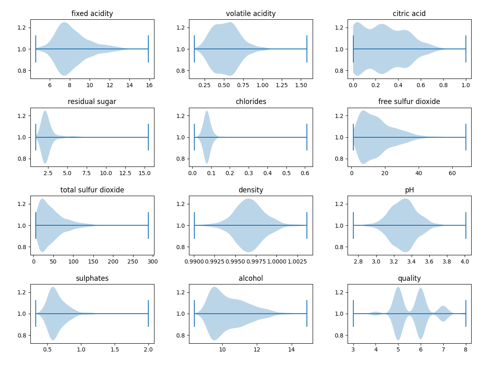

No missing or inconsistent data is found. The data is normalised using Gaussian normalisation (StandardScaler from sklearn) and stored in the “processed” folder of the data directory.

### MLP

The MLP class implementation includes init function where all the parameters and hyper parameters are initialised

Different activation functions like sigmoid, relu, tanh have been implemented. 

The fit function contains different optimisers - sgd, batch and mini batch gradient descent

The basic algorithm is:

```python
forward_pass()
back_propagation()
weight_update()
```

```python
def forward_pass(self, X):
        self.activations[0] = X
        self.z_values[0] = X
        
        for i in range(len(self.weights)):
            z = np.dot(self.activations[i], self.weights[i]) + self.biases[i]
            self.z_values[i+1] = z
            self.activations[i+1] = self._apply_activation(z, 
                                                                                               self.activation_function)
        
        self.activations[-1] = self.softmax(self.z_values[-1])
        return self.activations[-1]
```

```python
def back_propagation(self, X, y):
        y_pred = self.activations[-1]
        delta = y_pred - y

        self.weight_gradients[-1] = np.dot(self.activations[-2].T, delta)
        self.bias_gradients[-1] = np.sum(delta, axis=0, keepdims=True)

        for i in range(len(self.weights)-1, 0, -1):
            delta = np.dot(delta, self.weights[i].T) * 
                        self._apply_activation_derivative(self.z_values[i], 
                                                                      self.activation_function)
            self.weight_gradients[i-1] = np.dot(self.activations[i-1].T, delta)
                                                                                                            / X.shape[0]
            self.bias_gradients[i-1] = np.array([np.mean(delta, axis=0)])
```

```python
def weight_update(self):
        for i in range(len(self.weights)):
            self.weight_gradients[i] = np.clip(self.weight_gradients[i], -1, 1)
            self.bias_gradients[i] = np.clip(self.bias_gradients[i], -1, 1)
            self.weights[i] -= self.l_r * self.weight_gradients[i]
            self.biases[i] -= self.l_r * self.bias_gradients[i]
```

Note: To avoid large weight changes, weight gradients have been clipped between -1 and 1.

The cost function is cross entropy which is defined as:

```python
cost = -np.mean(y_true * np.log(y_pred))
```

The last layer activation function is sigmoid 

Taking the derivative of the last layer (delta), we get delta = y - y_pred

Further for other layers, the weight gradients are: activations from the previous neuron times the delta back propagated from the next layer

Checking the numerical gradients:

Numerical gradients are calculated by getting the value of loss function by slightly changing the parameter(weights and biases) at parameter+epsilon and parameter-epsilon and taking their difference divided by 2*epsilon

Comparing the numerical and analytical gradient is done by using the following formula:

```python
diff = np.linalg.norm(grad - grad_num) / (np.linalg.norm(grad + grad_num))
```

This difference is very less of the order $10^{-11}$ (as displayed below) hence the gradient calculations are correct.

```python
Weight Gradient Difference: 7.839317992336578e-11
Weight Gradient Difference: 6.441869578775531e-11
Weight Gradient Difference: 4.892402083639963e-11
Weight Gradient Difference: 5.4356057179306754e-12
Bias Gradient Difference: 1.1718124789263177e-10
Bias Gradient Difference: 1.2844589931585062e-10
Bias Gradient Difference: 1.794078649694786e-10
Bias Gradient Difference: 1.6893587496100902e-12
```

These differences are obtained for multi label classification and regression as we consider delta = ypred - y to begin with the back propagation. And this is also equal to the differential corresponding to the last layer.

But for MLP single label classification, last layer activation function is softmax, andas we de not consider the derivative of the softmax, the above *diff* of numerical and analytical gradient is not close to zero but is a constant value which remains same for all gradients - which ensures that the gradient calculation is correct.

### Training and Hyper parameter Tuning

Logging scores - loss and accuracy on validation set and train set using W&B

[MLP Single Label Classification WandB](https://wandb.ai/abhinav7/SMAI_ASG_3_Single_Label_Classification?nw=nwuserabhinav_raundhal)

Table is created here:

[MLP Single Label Classification Table](https://wandb.ai/abhinav7/SMAI_ASG_3_Single_Label_Classification/table?nw=nwuserabhinav_raundhal)

Also this has been exported in a csv file to find the best hyper parameters for the model. 

The csv file file is saved and a table has also been created in a text file in this folder: `assignments/3/runs/`

The best model is obtained on the basis of maximum validation accuracy.

The weights and biases have also been saved to a pickle file. The hyper parameters are saved to a json file for future references.

```python
Best Hyper parameters: 
optimizer :  mini_batch_gradient_descent
no_of_epochs :  100
neurons_per_layer :  [16, 10]
activation_function :  relu
l_r :  0.001
```

NOTE: The train corresponding to the best set of hyper parameters has been renamed as best_<hyperperparams> in wandb

### Evaluating Single-label Classification Model

Since the use of val set is now over, as we have obtained the hyper parameters. We only need train and test split to get the performance of the model on the basis of the hyper parameters obtained.

```python
# Results on test set
Test Accuracy:  0.6506550218340611
Test Precision:  0.28073736577197544
Test Recall:  0.2898188121402407
Test F1 Score:  0.28520581503170556
```

### Analysing Hyper parameters Effects

1. Effect of Non-linearity
    
    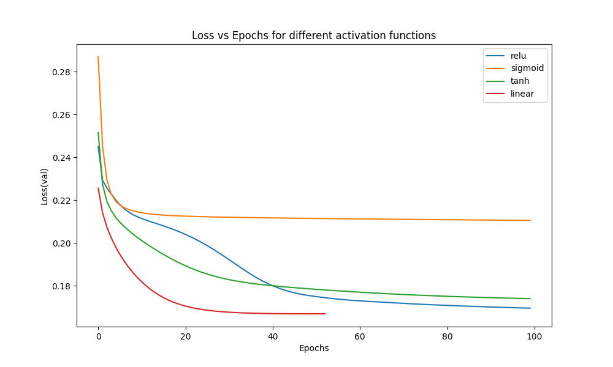
    
    The effect of different activation functions can be observed in the above graph. Multiple instances were run to obtain the graph and the general trend that was observed was that the loss in case of sigmoid converged very quickly but the loss was high as compared to others.
    
    Linear had the minimum loss butit was inconsistent. Where as tanh and relu were constant in their trend - loss decreased gradually and converged well.
    
2. Effect of Learning rate
    
    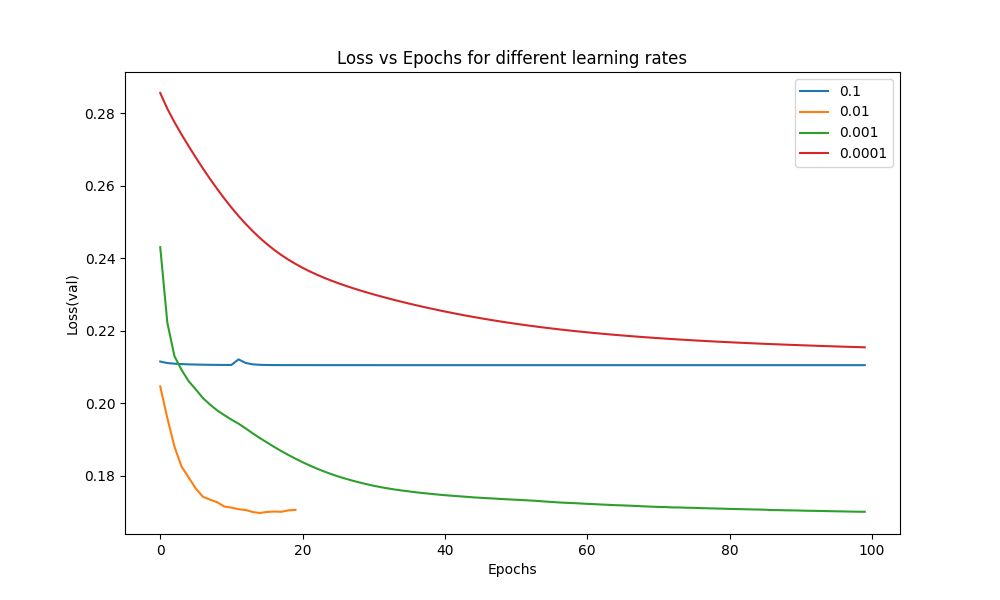
    
    Higher values of learning rates are bad as observed from the above graph. This can lead to poor performance as the model struggles to make meaningful updates and often overshoots the optimal point.
    
    Moderate learning rate (0.01), leads to a good convergence and also with a decent speed.
    
    Very low learning rates avoid the problem of missing the optimal point but are slow to converge. Hence 
    
3. Effect of Batch size
    
    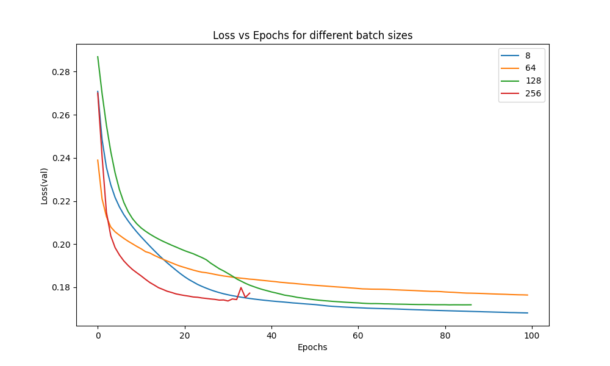
    
    Smaller batch sizes lead to faster convergence and allow for more frequent weight updates.
    
    A moderate batch size like 64 seems to strike the best balance between convergence speed and stability, offering the quickest and smoothest training process.
    
    Larger batch sizes tend to produce more stable but slower updates. While they lead to more stable gradients, they require more epochs to converge and may not reach as low a validation loss as smaller batch sizes in the same number of epochs.
    
    A very large batch can lead to fluctuations as seen in the above graph for batch size = 256.
    

### Multi Label Classification

For Multi Label classification, there are only a few changes to be done to the single label classification. 

1. The final layer activation function is changed to sigmoid as we do not necessarily need a probability distribution here. (Final classes are determined by thresholding: values > 0.5 are encoded as 1, otherwise 0)
2. The loss function is binary cross entropy: 
    
    ```python
    loss = -np.sum(y_true * np.log(y_pred) + (1 - y_true) * np.log(1 - y_pred))/n
    ```
    
3. The accuracy definition changes, its total matches between predicted and true classes by total number. Hamming loss is introduces which is:  
    
    ```python
    hamming loss = np.mean(y_true != y_pred)
    ```
    

Note: The data advertisement.csv has been label encoded wherever required. Then it is normalised (using sklearn StandardScaler) before using. The y values are one hot encoded.

Hyper parameter tuning:

[MLP Multilabel Classification WandB](https://wandb.ai/abhinav7/SMAI_ASG_3_Multilabel_Classification?nw=nwuserabhinav_raundhal)

Table: (also has been saved to a text file in `assignments/3/runs` )

[MLP Multilabel Classification Table](https://wandb.ai/abhinav7/SMAI_ASG_3_Multilabel_Classification/table?nw=nwuserabhinav_raundhal)

NOTE: The train corresponding to the best set of hyper parameters has been renamed as best_<hyperperparams> in wandb

Best model hyper parameters

```python
activation_function :  sigmoid
l_r :  0.01
optimizer :  sgd
no_of_epochs :  100
neurons_per_layer :  [16, 10, 5]
```

Performance on test set

```python
Test Accuracy:  0.659375
Test Precision:  0.6724137931034483
Test Recall:  0.06902654867256637
Test F1 Score:  0.12520064205457462
Test Hamming Loss:  0.340625
```

### Analysis

Single label classification:

| Quality | accuracy | precision | recall | f1_score |
| --- | --- | --- | --- | --- |
| 3 | 0.982 | 0.0 | 0.0 | 0.0 |
| 4 | 0.982 | 0.0 | 0.0 | 0.0 |
| 5 | 0.716 | 0.746 | 0.567 | 0.644 |
| 6 | 0.689 | 0.621 | 0.704 | 0.66 |
| 7 | 0.925 | 0.444 | 0.25 | 0.32 |
| 8 | 0.986 | 0.0 | 0.0 | 0.0 |

Here the accuracy, precision, recall and f1 score are calculated for each of the classes. The model does very well in terms of accuracy per class but it doesn’t make sense to have such a high accuracy which is dominated by true negatives. 

The model predicts the classes well for quality 5 and 6 specifically and also decent for quality=7. This is because of the skewed distribution of the data as seen in the violin plot below. The model has seen a biased data and has learnt the parameters taking this skewed data as the input and hence the results are good for specifically for these classes.

NOTE: values are 0 as the data is small and skewed so not all classes are present in the test set.

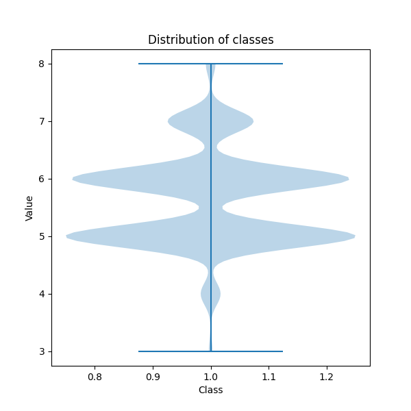

Multi label classification:

| Class | Accuracy | Precision | Recall | F1 Score | Hamming Loss |
| --- | --- | --- | --- | --- | --- |
| electronics | 0.645 | 0.0 | 0.0 | 0.0 | 0.355 |
| clothing | 0.715 | 0.555 | 0.25 | 0.344 | 0.285 |
| sports | 0.65 | 0.575 | 0.302 | 0.396 | 0.35 |
| furniture | 0.71 | 0.0 | 0.0 | 0.0 | 0.29 |
| beauty | 0.59 | 0.0 | 0.0 | 0.0 | 0.41 |
| food | 0.65 | 0.0 | 0.0 | 0.0 | 0.35 |
| home | 0.64 | 0.0 | 0.0 | 0.0 | 0.36 |
| books | 0.62 | 0.0 | 0.0 | 0.0 | 0.38 |

```python
def performance_metrics_multilabel(y, y_pred):

    y_pred = np.where(y_pred > 0.5, 1, 0)
    y = np.where(y > 0.5, 1, 0)
    # accuracy = accuracy_score(y, y_pred)
    tp, tn, fp, fn = 0, 0, 0, 0
    for i in range(len(y_pred)):
        for j in range(len(y_pred[i])):
            if y_pred[i][j] == y[i][j] and y[i][j] == 1:
                tp += 1
            elif y_pred[i][j] == y[i][j] and y[i][j] == 0:
                tn += 1
            elif y_pred[i][j] != y[i][j] and y[i][j] == 1:
                fn += 1
            elif y_pred[i][j] != y[i][j] and y[i][j] == 0:
                fp += 1
    
    precision = tp / (tp + fp) if tp + fp != 0 else 0
    recall = tp / (tp + fn) if tp + fn != 0 else 0
    f1 = 2 * precision * recall / (precision + recall) 
                                                            if precision + recall != 0 else 0
    hamming_loss = np.mean(y != y_pred)
    accuracy = 1 - hamming_loss
    
      return accuracy, precision, recall, f1, hamming_loss    
```

Here we can observe that the model performs poorly on most of the classes, with only 'clothing' and 'sports' categories showing some level of predictive power. The model completely fails to predict 'electronics', 'furniture', 'beauty', 'food', 'home', and 'books' categories, as indicated by their zero precision, recall, and F1 scores. 

The main reason being the threshold above and below which the class label is 1 or 0. So if this threshold is reduced to 0.4 (as there are a lot of classes which are not given as output just because the threshold is higher than the value given out by the model) the results improve:

| Class | Accuracy | Precision | Recall | F1 Score | Hamming Loss |
| --- | --- | --- | --- | --- | --- |
| electronics | 0.595 | 0.4 | 0.281 | 0.33 | 0.405 |
| clothing | 0.63 | 0.416 | 0.583 | 0.486 | 0.37 |
| sports | 0.64 | 0.533 | 0.421 | 0.47 | 0.36 |
| furniture | 0.695 | 0.444 | 0.206 | 0.282 | 0.305 |
| beauty | 0.59 | 0.5 | 0.451 | 0.474 | 0.41 |
| food | 0.635 | 0.411 | 0.1 | 0.16 | 0.365 |
| home | 0.62 | 0.454 | 0.277 | 0.344 | 0.38 |
| books | 0.51 | 0.372 | 0.421 | 0.395 | 0.49 |

Here all the classes are almost equally giving good results. There is less recall for food as compared to other classes but rest have good performance.

The data in this case is unlike the single label classification(it was skewed in single label classification - higher proportion of data from few classes). Here there is equal distribution across all classes. And hence the results are pretty close for all classes.

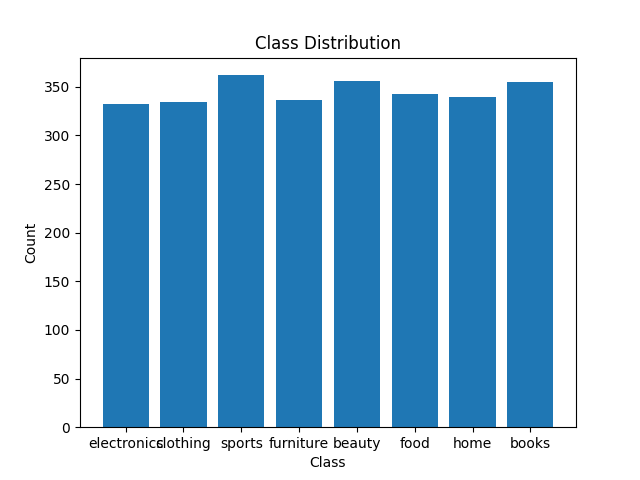

---

## Multilayer Perceptron Regression

HousingData 

Note: NA values are replaced with the mean of the data

| Feature | Average | Median | Standard Deviation | Min | Max |
| --- | --- | --- | --- | --- | --- |
| CRIM | 3.612 | 0.29 | 8.537 | 0.006 | 88.976 |
| ZN | 11.212 | 0.0 | 22.898 | 0.0 | 100.0 |
| INDUS | 11.084 | 9.9 | 6.693 | 0.46 | 27.74 |
| CHAS | 0.07 | 0.0 | 0.25 | 0.0 | 1.0 |
| NOX | 0.555 | 0.538 | 0.116 | 0.385 | 0.871 |
| RM | 6.285 | 6.208 | 0.702 | 3.561 | 8.78 |
| AGE | 68.519 | 74.45 | 27.412 | 2.9 | 100.0 |
| DIS | 3.795 | 3.207 | 2.104 | 1.13 | 12.126 |
| RAD | 9.549 | 5.0 | 8.699 | 1.0 | 24.0 |
| TAX | 408.237 | 330.0 | 168.37 | 187.0 | 711.0 |
| PTRATIO | 18.456 | 19.05 | 2.163 | 12.6 | 22.0 |
| B | 356.674 | 391.44 | 91.205 | 0.32 | 396.9 |
| LSTAT | 12.715 | 11.995 | 7.006 | 1.73 | 37.97 |
| MEDV | 22.533 | 21.2 | 9.188 | 5.0 | 50.0 |

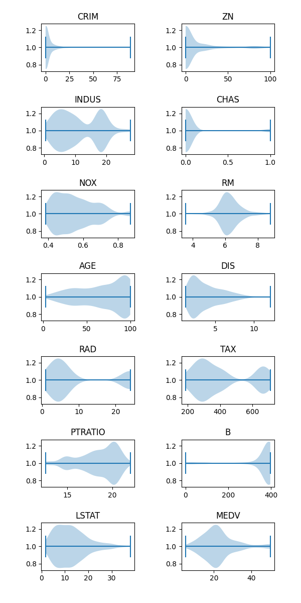

Only a few changes had to be made to the MLP classifier to construct the regression class. 

1. The loss function changes to MSE
2. The output layer is dimensions are always fixed to 1 and the activation function at the last layer is linear

### Hyper parameter tuning

[MLP Regression hyperparameter tuning WandB](https://wandb.ai/abhinav7/SMAI_ASG_3_MLP_Regression?nw=nwuserabhinav_raundhal)

Table: (also has been saved to a text file in `assignments/3/runs` )

[MLP Regression Table](https://wandb.ai/abhinav7/SMAI_ASG_3_MLP_Regression/table?nw=nwuserabhinav_raundhal)

NOTE: The train corresponding to the best set of hyper parameters has been renamed as best_<hyperperparams> in wandb

```python
Best Hyper parameters: 
l_r :  0.001
optimizer :  sgd
no_of_epochs :  400
neurons_per_layer :  [16, 10, 5]
activation_function :  tanh
```

```python
# results of the best regression model on the test set
mse: 0.008059676760660116 
mae: 0.07083433184005282
rmse: 0.08977570250719354
r2: 0.393014692720972
```

### Mean Squared Error vs Binary Cross Entropy

Data preprocessing: using sklearn’s StandardScaler, data was normalised to mean 0 variance 1

The regression class was modified temporarily to change the activation function from linear to sigmoid for the last layer and differential of the last layer also changes during back propagation to y-y^ * sigmoid_prime

In case of BCE with sigmoid the differential of the last layer is just y-y^ where y^ is the predicted y values.

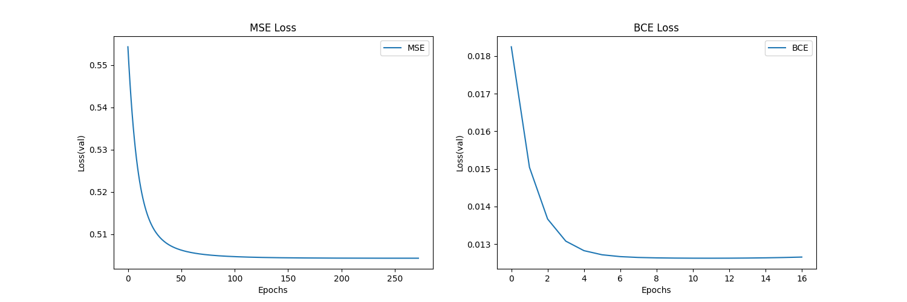

From the graph, the nature of the loss function is quite similar but there are 2 things to notice:

1. The loss is less in case of BCE
2. The convergence is faster (16 v/s 250 epochs)

The BCE is a better loss function to evaluate for, in case of classification tasks.

NOTE: This is one instance of the plot, depending on initialisation the nature of the graph changes slightly but the graph above is a good representation of the trend in these graphs.

### Analysis

[Of housing dataset regression]

First, this is the graph of predicted v/s actual values for regression on the test data points:

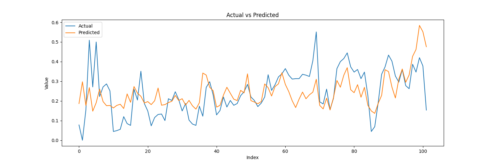

Now, the MSE was computed for individual points. The median MSE was found, points were then put into 2 different groups, ones with high mse and others with low mse.

The average values of the features were as follows:

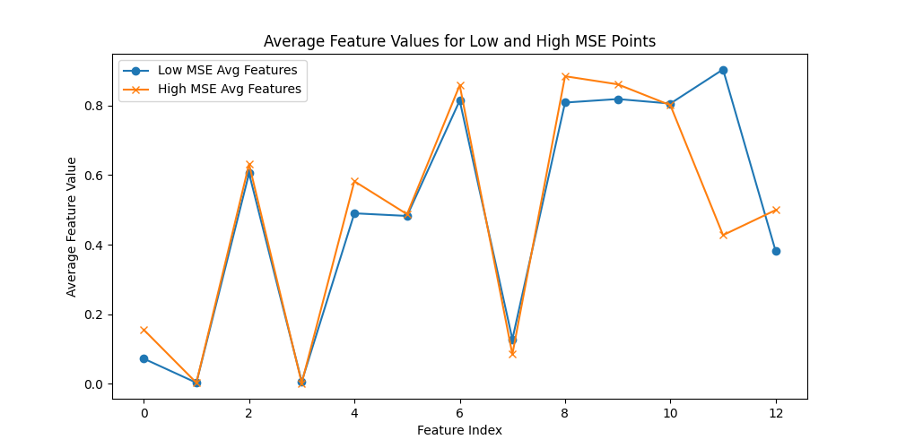

Here the 11th index which corresponds to LSTAT is different for the 2 classes - high mse points have a lower LSTAT as compared to low mse points.

The violin plots for these 2 separate sets of test data points:

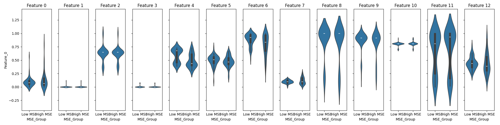

The distribution of the points is more or less similar in both the cases. But the distribution of points is more concentrated at mean in case of low MSE points as seen in feature 0, 6, 7 and 12.

Features with concentrated distributions for low MSE points could indicate that the model performs well when the input feature values are within a specific range. If values lie outside this range, the MSE tends to increase.

### BONUS

The 3 classes: MLP Classification, MLP Multi Label Classification and Regression were combined in a single class MLP and can be used by giving a parameter as to what task is to be done.

A few changes were made in the code by adding if/else statements to check which task is to be executed. Correspondingly, the loss function and the activation function of the last layer is changed wrt task provided.

---

## AutoEncoders

An object of an MLP class was created with task = regression.

The layers were modified to obtain a symmetric array of layers and the training was done with X being both the input and output data.

The get_latent() function returns the activations from the middle layer (reduced dimension layer)

The spotify dataset was reduced to 4 dimensions using PCA. Hence the reduced dimension = 4

Auto encoder architecture:

```python
activation_function = sigmoid
optimizer = mini_batch_gradient_descent
layers = input(15) + hidden(8) + reduced(4) + hidden(8) + input(15)
batch_size = 32
```

Results:

```python
# results with early stopping based on val loss
Epoch: 184/200, Error: 0.14097125777273817
Validation Error: 0.13960228410523984
```

Basically, first got approximate no of epochs and a good set of hyper parameters by analysis the val loss, then the entire data was transformed to 4 dimension using these hyper parameters(for which the obtained reconstruction loss is reported below). The reduced spotify dataset (4-dimensional) is stored to a csv file for further use.

```python
# reconstruction loss on the entire spotify dataset
Reconstruction Loss:  0.13846954581544083
```

KNN was run on this reduced dataset and the following results were obtained:

```python
# results on spotify dataset reducing using AutoEncoder
K: 20, Distance Metric: manhattan
Accuracy:  0.1744736842105263
Precision:  0.16774883440340665
Recall:  0.1746079795707071
F1 Score:  0.17110969523588757
```

```python
# assignment 1 - results on spotify dataset
K: 20, Distance Metric: manhattan
Accuracy: 0.24791648390209667
Precision: 0.23988512314791263
Recall: 0.24962659728560394
F1 Score: 0.24465893064958527
```

```python
# assignment 2 - results on reduced spotify using PCA
K: 20, Distance Metric: manhattan
Accuracy: 0.18947368421052632
Precision: 0.17952695660672296
Recall: 0.19037714051575141
F1 score: 0.18479291746242632
```

Comparison:

As the dataset is reduced using some kind of dimensionality reduction, the performance has reduced on the dimensionally reduced datasets as compared to the original dataset.

In case of PCA the dimensionality reduction was done giving priority to the important features as the ones corresponding to higher eigen values were retained.

In case of the auto encoder the dimensionality reduction was carried out by the model depending on what kind of features it learns.

The performance on both the reduced datasets is almost the same ~ 17-18%

### MLP Classification

Architecture and hyper parameters:

```python
l_r=0.01
activation_function='sigmoid'
optimizer='mini_batch_gradient_descent'
hidden_layers=1,
neurons_per_layer=[10]
batch_size=32
no_of_epochs=200
```

The results from the MLP classification on the entire spotify dataset:

```python
Accuracy:  0.196359649122807
Precision:  0.15008660087164258
Recall:  0.19641521266644427
F1 Score:  0.170153750871189
```

Results on reduced dataset from auto encoder:

```python
Accuracy:  0.09210526315789473
Precision:  0.054769803758195706
Recall:  0.0917096633990569
F1 Score:  0.06858190249564715
```

In general the MLP classification is poor in terms of the performance in both: entire dataset and the reduced dataset as compared to KNN.

The reason could be the lack of the model architecture to capture the complex features of the data. Might be in terms of number of layers, or the accurate activation function or optimiser. It requires an extensive search over the different possibilities to get the best results. Whereas KNN is a simple algorithm to classify based on the distance measures. 

Due to dimensionality reduction, there is a loss in data. KNN can still perform relatively well even with reduced dimensionality since it operates based on nearest neighbours and distances in the reduced space. MLP on the reduced dataset, on the other hand, struggles because the reduced feature set may lack the complexity required for the MLP to differentiate between classes effectively.

---