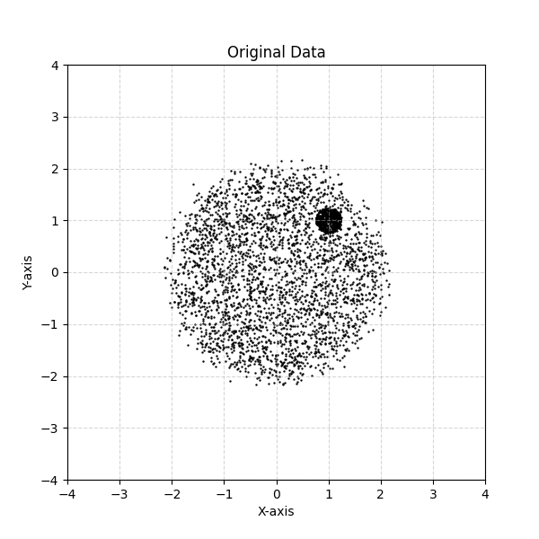
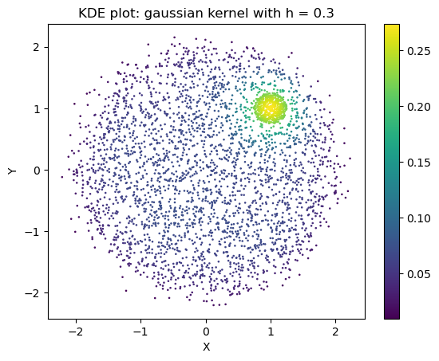
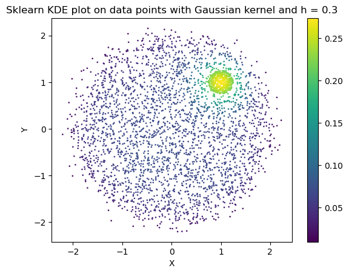
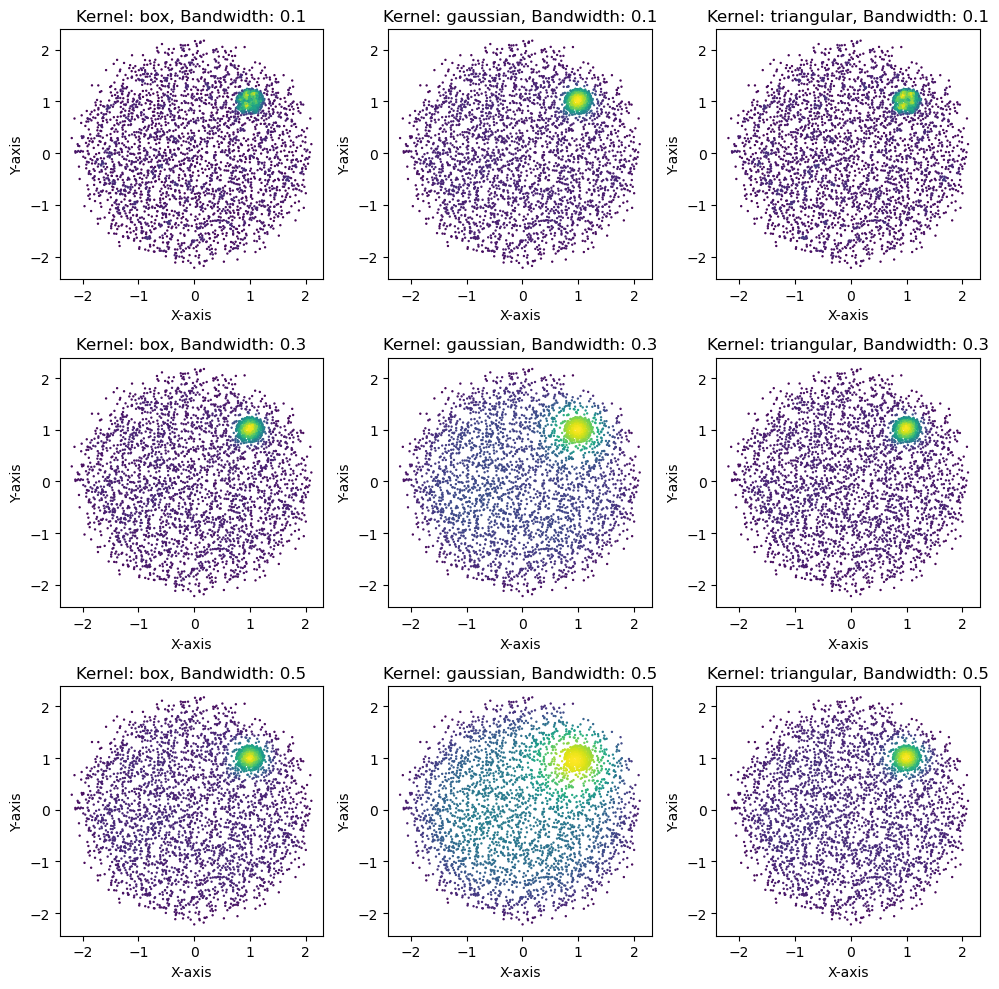
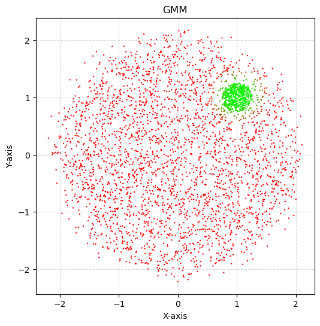
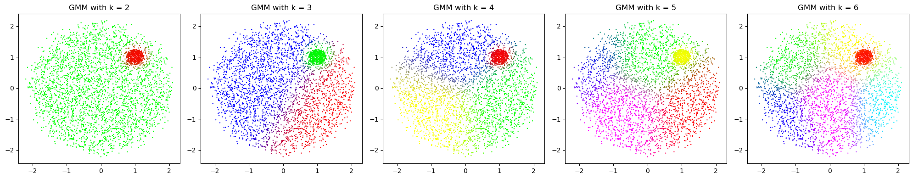
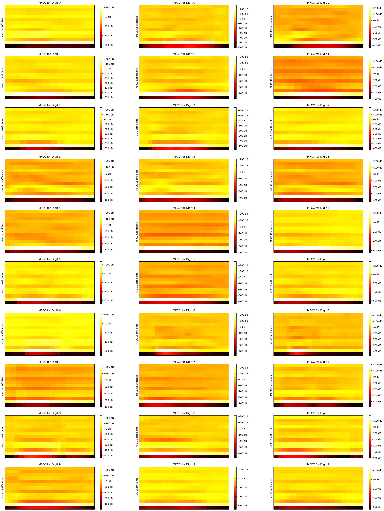

# Assignment 5

## KDE

```python
def K(self, x):
        # box, gaussian and traingular kernels
        if self.kernel == 'box':
            return np.prod(np.abs(x) <= 0.5, axis=1)
        elif self.kernel == 'gaussian':
            return np.exp(-0.5*np.sum(x**2, axis=1)) * (2*np.pi)**(-self.d/2)
        elif self.kernel == 'triangular':
            return np.maximum(1 - np.sum(np.abs(x), axis=1), 0)
        else:
            print("Invalid kernel")
            return None

    def fit(self, data):
        self.data = data
        self.n, self.d = data.shape
        
    
    def predict(self):
        self.kde = np.sum([self.K((self.data - self.data[i])/self.h) 
                                for i in range(self.n)], axis=0)/(self.n*self.h**self.d)
        return self.kde
```

Dataset generated by sampling points uniformly in 2 circles and adding some noise



KDE on this dataset:



Comparing with sklearn KDE



Playing around with kernels and bandwidth (h) 



Best combination is h = 0.3 and kernel = gaussian

GMM with 2 components



GMM with increasing number of components



The observation with number of components = 2 for GMM, we get 2 clusters. The one for the bigger circle and one for the smaller circle of data points. With an increase in the number of components for GMM, the data (the points in the bigger circle) is further split into smaller and smaller clusters. This tells us that the gaussian mixture model is not able to capture the underlying structure of the data and depends on the number of components to split the data into clusters. Whereas KDE is able to capture the underlying structure of the data and does not depend on the number of components to split the data into clusters. It consistently fits the data well even after changing the bandwidth parameter 'h' as shown in the plots above.

---

## HMM

MFCC (Mel-Frequency Cepstral Coefficients) for each digit


3 MFCCs for each digit 



These are the heat map visualisation of the MFCCs of the digits. The MFCCs are distinct across different digits, capturing unique patterns in their audio features. However, there are consistent patterns within the MFCCs of the same digit, reflecting shared characteristics in their frequency components. These patterns make HMM a suitable method for this task as it models sequential data effectively. It can capture temporal dependencies and variations within each digit's audio signal and hence is suitable for this task.

```python
def train(self, train_data, n_components=10, n_iter=100):
        for digit, mfcc_list in train_data.items():
            model = hmm.GaussianHMM(n_components=n_components, 
                            covariance_type="diag", n_iter=n_iter)
            X = np.concatenate(mfcc_list)
            model.fit(X)
            self.models[digit] = model

    def predict(self, test_data):
        preds = []
        for mcff in test_data:
            scores = [model.score(mcff) for model in self.models.values()]
            pred = np.argmax(scores)
            preds.append(pred)
        return preds
```

**Accuracy: 91.17%**

On my recorded audio files:

Targets: [9, 8, 6, 7, 5, 4, 0, 1, 3, 2]  
Predictions: [1, 8, 1, 1, 1, 1, 7, 5, 3, 1]  
Accuracy: 20.00%

The accuracy on known test set is more than 90% whereas the accuracy on my recorded set of audios is very less (< 50%). The reason is the difference in the way the audios are (the accent, the speed, the noise, etc.). Since the known test set contains audios from the same set of people whose data is used during training, the model is able to predict the digits correctly. But when the audios are from different people than the training data(like me), the model is not able to predict the digits correctly. This is the limitation of hmm model where it is not able to generalize well on diverse audio inputs.

---

## RNN

Refer to the python notebooks for RNN - counting bits and OCR tasks.

---